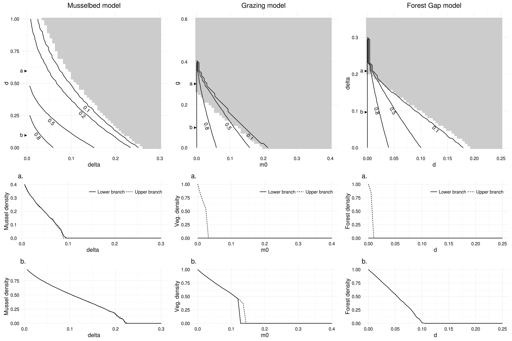

# ifcam_output

Output (data and figures) for IFCAM project #1.

The purpose of this repository is to hold the *reference* copies of data and 
*final* manuscript figures, without polluting caspr and spatial_warnings 
repositories.

Below are some results and files you might be interested in. 

# Simulation outputs

Simulations include two types of runs: 
  
 - Runs for phase diagrams: 100x100 matrices using all unique combinations
 of 51 values of the homogeneous + heterogeneous stressor.
  
  - [Musselbed](http://alex.lecairn.org/ifcam/result_musselbed_processed.rda)
  - [Forestgap](http://alex.lecairn.org/ifcam/result_forestgap_processed.rda)
  - [Grazing](http://alex.lecairn.org/ifcam/result_grazing_processed.rda)
    
 - Runs for cross-sections: 400x400 matrices using 3 well-chosen values for 
 heterogeneous stressor and 201 values for homogeneous stressor (see cross-
 sections chosen on the bifurcation diagrams below).

  - [Musselbed](http://alex.lecairn.org/ifcam/result_musselbed_cs_processed.rda)
  - [Forestgap](http://alex.lecairn.org/ifcam/result_forestgap_cs_processed.rda)
  - [Grazing](http://alex.lecairn.org/ifcam/result_grazing_cs_processed.rda)

A complete list of files is also [available](http://alex.lecairn.org/ifcam). 
Raw files are processed so that matrices are converted to `binary_matrix` objects
which are easier to handle using the [spatialwarnings](http://github.com/fdschneider/spatial_warnings) package. Raw files do not have the "_processed" suffix. 

Data files include lists named `upper_branch`, `lower_branch` or just `branch`
of three components in this order:  

 - `DatBif`: Summary data frame of all simulations
 - `snaps`: Snapshots of landscapes taken around equilibrium
 - `time_series`: Full time-series (from the start of simulation) of covers

Some of these components can grow very big so do not hesitate to drop some of 
them when analysing them (e.g. with `rm`).

# Bifurcation diagrams

# Generic indicators

Trends for generic indicators are available in the figures folder. Current 
figures include 4x4 and 10x10 coarse-graining length as indicated in the file 
name. 

-> Link: [Generic indicators](./figures/generic_indicators/)

Figures include theo observed trends with standard deviations in black/gray, and
null trends with standard deviations in red/light red. Trends are displayed
along the homogeneous stressor gradient, with three values of the heterogeneous
stressor (columns).

