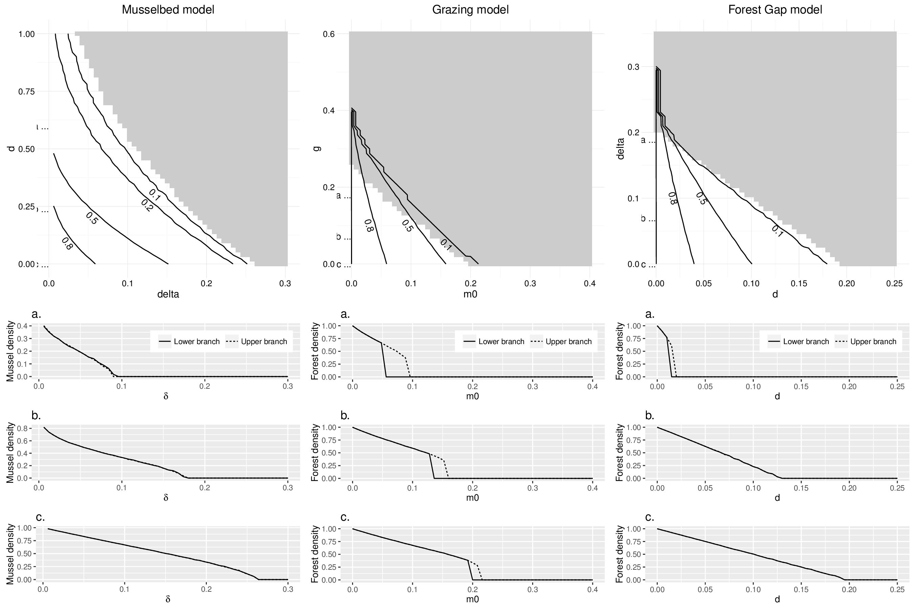

# ifcam_output

Output (data and figures) for IFCAM project #1.

The purpose of this repository is to hold the *reference* copies of data and 
*final* manuscript figures, without polluting caspr and spatial_warnings 
repositories.

Below are some results and files you might be interested in. 

# Output from simulations 

 - [Musselbed output](./data/result_musselbed_processed.rda)
 - [Grazing output](./data/result_grazing_processed.rda)
 - [Forest Gap output](./data/result_forestgap_processed.rda)
 
# Bifurcation diagrams

To come: ews, psds, etc. 
